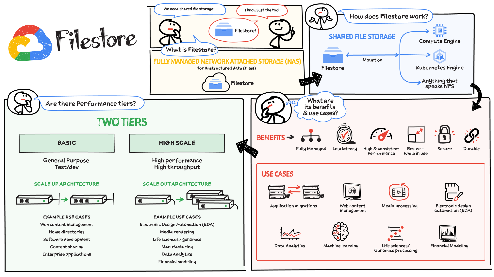

# What are the different storage types? 
 | [:link:](https://cloud.google.com/blog/topics/google-cloud-next/complete-list-of-announcements-from-google-cloud-next20-onair)

Choosing the Right Storage for Your Applications. There are three main categories of data storage applications use: object storage, block storage, and file storage. Each offers unique advantages depending on your needs.

- Object Storage: Ideal for large, unstructured data like media files, backups, and logs. Objects are self-contained units with unique IDs and metadata for easy access. Think of it like a giant warehouse with labeled boxes – you can quickly find what you need without worrying about folders or directories. Cloud Storage is a good example of object storage.

- Block Storage:  Perfect for high-performance applications like databases and virtual machines. Data is divided into fixed-size blocks, offering fast access and flexibility. Imagine a set of building blocks – you can arrange them in any order to create what you need. Block storage like Persistent Disk and Local SSD is a good choice for demanding workloads.

- File Storage:  Think of your computer's folders and files – that's file storage. Data is organized in a hierarchical structure for easy browsing and access. Network Attached Storage (NAS) is a common type, allowing multiple users to share a central file system. Cloud-based options like Filestore simplify management for large amounts of data.

# What is Google Cloud Storage? 
 | [:link:](https://cloud.google.com/blog/topics/google-cloud-next/complete-list-of-announcements-from-google-cloud-next20-onair)

Secure, Scalable Home for All Your Data. Cloud Storage is your one-stop shop for storing all sorts of digital files – images, videos, documents, and more. It's designed for massive scale, keeping your data secure and accessible wherever you need it.

What Makes Cloud Storage Special?

- Built for Flexibility: Store any type of file, from everyday documents to large media collections.

- Always Available: Access your data anytime, anywhere – Cloud Storage scales seamlessly to meet your needs.

- Security First: Cloud Storage keeps your data safe with robust security features and access controls.

- Smart Organization: Each file is assigned a unique ID and has customizable tags for easy searching and retrieval.

With its flexibility and robust features, Cloud Storage is a perfect fit for a wide range of applications, from web servers to data analysis tools.

# Why Move Your Data to Google Cloud?
 | [:link:](https://cloud.google.com/blog/topics/google-cloud-next/complete-list-of-announcements-from-google-cloud-next20-onair)

There are many reasons to migrate your data to Google Cloud, including:

- Data Center Consolidation: Move your data storage off-site and free up resources.

- Machine Learning Magic: Fuel your machine learning projects with vast datasets in Google Cloud.

- Content Delivery Made Easy: Store and deliver content like images and videos efficiently.

- Reliable Backups and Archiving: Protect your valuable data with secure backups and long-term archiving solutions.

No matter the reason, when moving data, these factors are crucial:

- Reliability: Your data transfer should be dependable and error-free.

- Predictability: Know exactly how long the transfer will take.

- Scalability: The service should handle small and massive datasets efficiently.

- Security: Your data must be protected during the entire transfer process.

- Data Consistency: The transferred data should be complete and accurate.

Google Cloud: Your One-Stop Data Transfer Shop

Google Cloud offers a variety of tools to fit your specific needs and data size:

- Cloud Storage Transfer Tools: Ideal for small transfers (up to a few terabytes) directly from your computer. These include the user-friendly Google Cloud Console interface, a JSON API for programmatic access, and the powerful GSUTIL command-line tool for scripting transfers.

- Storage Transfer Service: This managed service is perfect for larger online data transfers (petabytes!) from various sources, including other clouds, on-premises storage, or even between buckets within Google Cloud. It offers features like recurring transfers, scalability to handle high-speed data movement (10s of Gbps), and detailed transfer logs.

- Transfer Appliance:  This physical appliance is the answer for migrating massive datasets, especially when high-bandwidth internet isn't available. It securely encrypts your data and ships it to Google for upload to your Cloud Storage bucket. This method is significantly faster than traditional online transfers, especially for very large datasets (think petabytes!).

- BigQuery Data Transfer Service:  This service is a dream for your data analysis team. It automates transferring data to your BigQuery data warehouse, eliminating the need for custom coding. It supports data movement from various sources, including external cloud storage providers, SaaS applications, and data warehouses like Teradata and Amazon Redshift.

With Google Cloud's data transfer solutions, you can move your data securely, efficiently, and at a pace that fits your needs.

# What is Filestore? 

 | [:link:](https://cloud.google.com/blog/topics/google-cloud-next/complete-list-of-announcements-from-google-cloud-next20-onair)

Effortless File Sharing for Your Cloud Applications. Filestore is your one-stop shop for managing and sharing files in the cloud. It takes care of everything behind the scenes, so you can focus on what matters – your applications.

Key benefits of Filestore:

- High Performance: Access your files quickly and efficiently, ideal for demanding workloads.

- Fully Managed: No need to worry about server setup or maintenance – Filestore handles it all.

- Seamless Sharing: Easily share files between virtual machines and containers in Google Cloud.

- Broad Compatibility: Filestore works with anything that speaks NFS, making it a versatile file storage solution.

- Simplified Cloud Migration: Migrate your existing applications to the cloud without extensive code changes.

- With Filestore, you can ditch complex file management and focus on building great applications.

# What is Persistent Disk?
 | [:link:](https://cloud.google.com/blog/topics/google-cloud-next/complete-list-of-announcements-from-google-cloud-next20-onair)

Virtual machines are great, but what happens to your data when they restart? Persistent Disk solves this by providing reliable storage that persists even after a reboot.

Think of it like this: Imagine your virtual machine is a powerful computer, but it doesn't have built-in storage. Persistent Disk acts like an external hard drive that you can attach to your VM. This disk uses SSDs for speed or HDDs for cost-effectiveness, depending on your needs.

Choosing the Right Disk:

Just like choosing a car, there's a Persistent Disk type for every need:

- Standard PD (HDD): Affordable and ideal for basic applications and large-scale data analysis.

- Balanced PD (SSD): A good balance between price and performance, perfect for everyday workloads.

- Performance PD (SSD): Prioritizes speed, making it suitable for demanding tasks like databases and complex analytics.

- Extreme PD (SSD): Unleashes the ultimate performance for applications like in-memory databases.

Local SSD: Offers the lowest latency for lightning-fast processing, ideal for data processing and temporary storage needs.

Availability Matters:

- Local SSD: Best for temporary data in stateless applications, where data replication happens elsewhere.

- Persistent Disk: Durable storage with automatic backups, suitable for most workloads.

- Regional Persistent Disk: Highest availability option, replicated across zones for near-instantaneous recovery in case of outages.

# which storage should i Use
 | [:link:](https://cloud.google.com/blog/topics/google-cloud-next/complete-list-of-announcements-from-google-cloud-next20-onair)

## Picking the Perfect Storage for Your Cloud Applications

Choosing the right storage for your application depends on what you need it to do. Google Cloud offers a variety of options across three main storage types: object storage, block storage, and file storage. Here's a breakdown to help you pick the perfect fit:

## Object Storage: Your Data Vault in the Cloud (Cloud Storage)

- Ideal for: Storing any type of data, from videos and images to backups and archives.

- Best for applications that need:

  - High availability: Your data is always accessible, making it great for streaming services and websites.

  - Durability: Object storage keeps your data safe for long periods, perfect for regulatory compliance or disaster recovery.

  - Scalability: Easily store massive datasets for data analysis or genomics research.

- Think of it as a giant filing cabinet with labeled folders (buckets) and self-contained boxes (objects) with detailed tags for easy search.

- Choose from different storage classes based on your budget and access needs:

  - Standard: Fastest access and highest availability, ideal for frequently used data.

  - Nearline, Coldline, Archive: More economical options for data that's accessed less often.

## Block Storage: High-Performance Building Blocks (Persistent Disk & Local SSD)

- Perfect for: Virtual machines (VMs) and applications requiring fast data access.

- Think of it as pre-cut, ready-to-use building blocks for your VMs.

- Persistent Disk: Block storage designed for VMs, offering a range of performance options.

  - Use cases: VM disks, shared data across VMs, and high-performance databases.

- Local SSD: Super-fast temporary storage ideal for:

  - Applications requiring the lowest latency (think flash memory).

  - Temporary tasks like data processing, media rendering, or scratch disks.

## File Storage: Sharing Made Easy (Filestore)

- Imagine a central file system accessible to everyone in your office – that's Filestore.

- A cloud-based shared file system for unstructured data, offering:

  - Low latency for smooth operation.

  - Concurrent access for multiple users (think tens of thousands!).

  - Scalability to handle massive workloads (hundreds of TBs and high IOPS/throughput).

- Perfect for:

  - High-performance computing (HPC) tasks.

  - Media processing and editing.

  - Web content management and application migrations.

  - Life science data analysis and more!