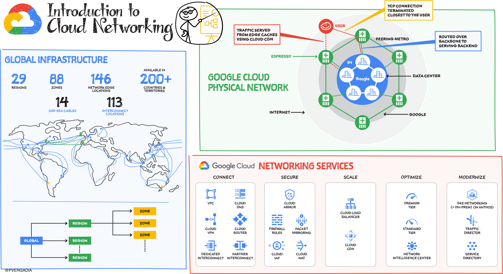
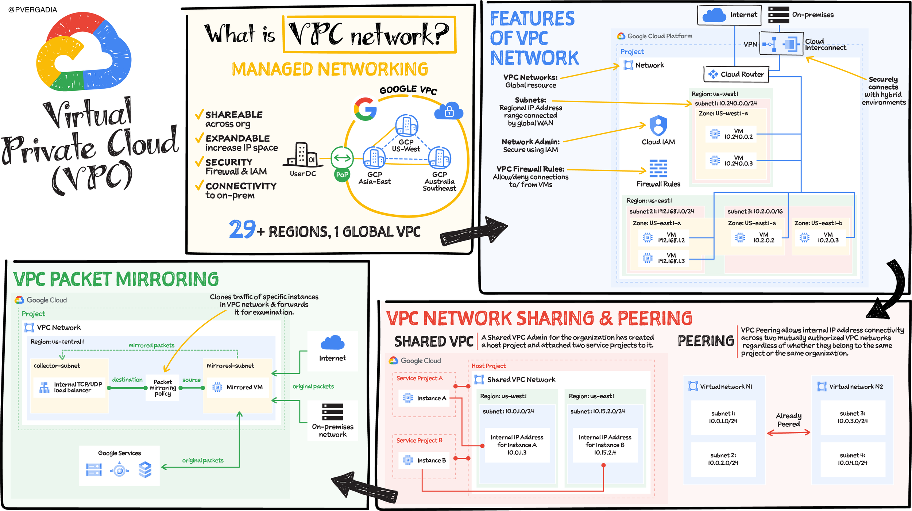

# Introduction to cloud Networking
 | [:link:](https://cloud.google.com/blog/topics/google-cloud-next/complete-list-of-announcements-from-google-cloud-next20-onair)

# Network Service Tiers
 | [:link:](https://cloud.google.com/blog/topics/google-cloud-next/complete-list-of-announcements-from-google-cloud-next20-onair)

# Network Connecvitivyt options

 | [:link:](https://cloud.google.com/blog/topics/google-cloud-next/complete-list-of-announcements-from-google-cloud-next20-onair)

# Virtual Private Cloud
 | [:link:](https://cloud.google.com/blog/topics/google-cloud-next/complete-list-of-announcements-from-google-cloud-next20-onair)

# Cloud DNS
 | [:link:](https://cloud.google.com/blog/topics/google-cloud-next/complete-list-of-announcements-from-google-cloud-next20-onair)

# Cloud Load Balancing
 | [:link:](https://cloud.google.com/blog/topics/google-cloud-next/complete-list-of-announcements-from-google-cloud-next20-onair)

# Cloud CDN
 | [:link:](https://cloud.google.com/blog/topics/google-cloud-next/complete-list-of-announcements-from-google-cloud-next20-onair)

# Cloud NAT
 | [:link:](https://cloud.google.com/blog/topics/google-cloud-next/complete-list-of-announcements-from-google-cloud-next20-onair)

# Network Intelligence Center
 | [:link:](https://cloud.google.com/blog/topics/google-cloud-next/complete-list-of-announcements-from-google-cloud-next20-onair)

# Traffic Director
 | [:link:](https://cloud.google.com/blog/topics/google-cloud-next/complete-list-of-announcements-from-google-cloud-next20-onair)

# Service Discovery
 | [:link:](https://cloud.google.com/blog/topics/google-cloud-next/complete-list-of-announcements-from-google-cloud-next20-onair)

# Networking Overview
 | [:link:](https://cloud.google.com/blog/topics/google-cloud-next/complete-list-of-announcements-from-google-cloud-next20-onair)

