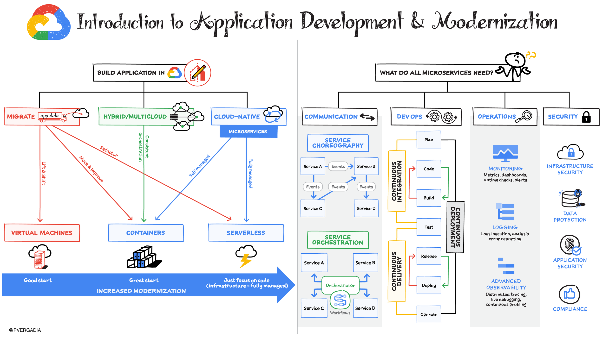
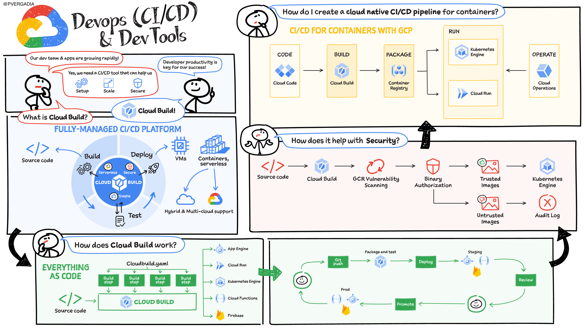
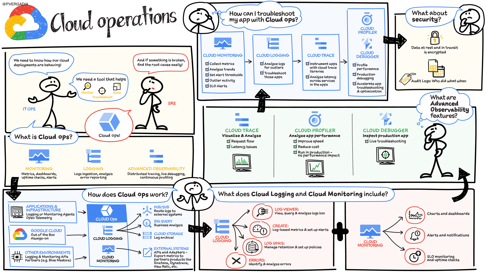
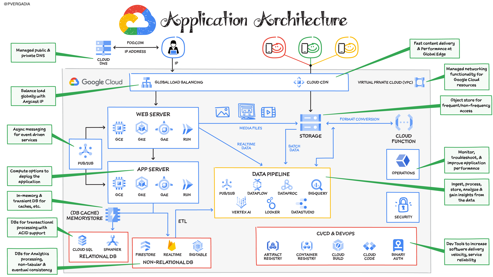

# Introduction to Application Development and Modernization
 | [:link:](https://cloud.google.com/blog/topics/google-cloud-next/complete-list-of-announcements-from-google-cloud-next20-onair)

So you've decided to leverage the cloud for your next application – a smart move! But before diving in, there are a few key questions to consider, as they'll shape your entire development process and the tools you'll need:

- Modernization or Greenfield?  Are you revamping an existing on-premise application for the cloud, or building a brand new cloud-native application from scratch?

- Cloud or Hybrid?  Will your application reside solely in the cloud (public cloud), or will it integrate with on-premise systems in a hybrid environment, or even span multiple cloud providers (multicloud)?

These initial choices will determine the most suitable cloud deployment strategy for your project. Let's explore each option in more detail to help you pick the right fit!

# Migration Journey
 | [:link:](https://cloud.google.com/blog/topics/google-cloud-next/complete-list-of-announcements-from-google-cloud-next20-onair)

A successful application migration to the cloud starts with understanding where you are. Here's how to plan a winning strategy:

- Take a Holistic View:  Don't just focus on technical aspects. Consider your business goals (present and future), critical deadlines, and your team's capabilities.

- Identify Your Time-to-Value:  Different migration approaches offer varying speeds to value realization. There's no one-size-fits-all solution, but the key is knowing you can always build on your progress and unlock more cloud benefits incrementally.

# Anthos
 | [:link:](https://cloud.google.com/blog/topics/google-cloud-next/complete-list-of-announcements-from-google-cloud-next20-onair)

The cloud landscape is vast, with applications scattered across data centers, public clouds, and the edge. These applications often run on unique technology stacks, creating a development and management nightmare. Here's how this translates into challenges:

- Slow Developer Velocity: Inconsistent environments hinder developer productivity.

- Wasted Resources: Disparate technology stacks lead to inefficient resource utilization.

- Limited Scalability: Scaling applications across these fragmented environments becomes complex.

- Fragmented Management: Centralized visibility and control over resources are difficult to achieve.

Introducing Anthos: Your Multicloud Management Hero

Anthos offers a solution by providing a consistent platform for managing applications across hybrid and multicloud environments. It eliminates the complexities of traditional deployments, allowing you to:

- Unify Development: Develop and deploy applications consistently across any environment, using your preferred languages and frameworks.

- Optimize Resource Use: Anthos leverages a single platform, streamlining resource management and reducing waste.

- Effortless Scaling: Scale your applications seamlessly across your hybrid or multicloud infrastructure.

- Centralized Visibility: Gain a unified view and control over all your applications and resources from a single pane of glass.

# Hybird and MultiCloud Deployments

 | [:link:](https://cloud.goog
le.com/blog/topics/google-cloud-next/complete-list-of-announcements-from-google-cloud-next20-onair)

Anthos is a game-changer for managing applications across hybrid and multicloud environments. It extends Google Cloud's services and best practices to your existing infrastructure, allowing you to:

- Modernize applications faster: Streamline app modernization by leveraging consistent tools and practices across environments.

- Achieve operational consistency: Ensure your applications run smoothly and securely, regardless of location.

Unlocking Flexibility with Deployment Options:

Anthos offers a variety of deployment options to fit your specific needs:

- Google Cloud: Deploy Anthos directly on Google Cloud for a fully managed experience with Google Kubernetes Engine (GKE).

- VMware vSphere: Integrate Anthos with your existing VMware vSphere environment for seamless containerization of virtual machines.

- Bare-Metal Servers: Run Anthos on bare-metal servers for greater control over your infrastructure.

- Anthos Attached Clusters: Connect existing Kubernetes clusters to Anthos for centralized management and policy enforcement.

- Coming Soon: AWS & Azure Support: Anthos will soon extend its reach to AWS and Azure environments, providing a truly unified application platform across all major cloud providers.

#Devops CI CD

 | [:link:](https://cloud.google.com/blog/topics/google-cloud-next/complete-list-of-announcements-from-google-cloud-next20-onair)

Streamline Development with CI/CD

Imagine a world where catching bugs is a breeze and deployments are smooth sailing. That's the power of CI/CD.

- Continuous Integration (CI):
 Identify and fix issues early! With CI, you integrate code changes frequently, not all at once. Each integration triggers an automated build, allowing you to detect problems quickly and prevent them from snowballing.

- Continuous Delivery (CD):
 CD takes CI a step further. It automates packaging and preparing your software for delivery, enabling frequent releases of incremental changes to users. Deployment strategies like red/black or canary deployments minimize risk by introducing changes to a limited audience first.

Benefits of CI/CD:

- Reduced Risk: Catch problems early and release with confidence.

- Faster Releases: Deploy changes quickly and iterate on features more frequently.

- Simplified Process: Automated builds and deployments free developers to focus on what they do best – writing great code.

# Microservice Architecture
 | [:link:](https://cloud.google.com/blog/topics/google-cloud-next/complete-list-of-announcements-from-google-cloud-next20-onair)

The tech landscape has evolved rapidly, introducing game-changers like containerization, container orchestration, and serverless services.  These advancements empower you to develop distributed applications based on microservices architectures, offering:

- Enhanced Scalability: Easily scale individual services to meet growing demands.

- Improved Reliability: Isolate failures to prevent cascading disruptions.

What are Microservices?

Microservices architecture breaks down large applications into smaller, independent services. Each service owns a specific function, and microservices applications combine these services to deliver complete user experiences.

Containers: Perfect Partners for Microservices

Containers provide a lightweight and isolated environment for each microservice, allowing developers to focus on service logic without worrying about dependency conflicts. Modern cloud-native applications often leverage containers and microservices together.

Deploying Microservices on Google Cloud

Google Cloud offers seamless deployment options for your microservices:

- Google Kubernetes Engine (GKE): A managed container orchestration service for deploying and managing containerized applications.

- Cloud Run: A fully managed serverless platform that removes server management complexities.

Beyond Deployment: A Rich Ecosystem

Google Cloud offers a comprehensive suite of services that integrate with your microservices architecture, including Cloud SQL and various other tools to support your specific needs.

# Service Orchestration
 | [:link:](https://cloud.google.com/blog/topics/google-cloud-next/complete-list-of-announcements-from-google-cloud-next20-onair)

Microservices: Power and Coordination

Moving from monolithic applications to microservices brings significant advantages like reusability, scalability, and simpler modifications.  However, these independent services need to communicate to solve complex business problems. This is where event-driven architectures come in.

Event-Driven Communication: Two Key Approaches

Event-driven architectures enable microservices to communicate by exchanging messages about events that occur within each service. There are two main ways to implement this:

- Choreography: Microservices publish events and listen for relevant events from other services, reacting independently. They are responsible for their own logic and interactions.

- Orchestration: A central service, often an orchestrator, dictates the sequence of events and manages communication between microservices. This approach offers more control but can become a bottleneck.

Choosing the right approach depends on your specific needs and the complexity of your microservices interactions.

# API Management

 | [:link:](https://cloud.google.com/blog/topics/google-cloud-next/complete-list-of-announcements-from-google-cloud-next20-onair)

APIs are the building blocks of today's modern applications, fueling innovation and collaboration across businesses. They empower companies to:

- Move Faster: Streamline development and delivery of applications.

- Boost Innovation: Foster a culture of open ecosystems for richer functionalities.

- Stay Competitive: Unlock new opportunities and partnerships.

However, managing APIs securely and efficiently across complex environments – on-premise, private/public cloud, SaaS, and more – can be a challenge. This is where API management comes in.

Introducing API Management: Simplifying the API Landscape

Imagine you have a complex backend with various services – REST/SOAP, microservices, and third-party integrations. You also have diverse consumers – partners, employees, and customers – all relying on APIs to access or manipulate data.

API management helps bridge this gap by:

- Centralized Control: Securely deliver, manage, and analyze APIs, data, and services.

- Developer Portal: Provide a user-friendly platform for developers to discover, explore, and utilize your APIs.

- Streamlined Consumption: Make it easy for various applications to interact with your backend services.

Unlocking the Value of APIs

Developers can leverage API management to:

- Compose Innovative Applications: Build powerful applications by easily integrating with your APIs.

- Thriving Ecosystems: Contribute to a flourishing digital ecosystem where businesses collaborate and co-create value.

# Cloud Operations

 | [:link:](https://cloud.google.com/blog/topics/google-cloud-next/complete-list-of-announcements-from-google-cloud-next20-onair)

Imagine this:  You suspect an issue with your cloud deployment, potentially impacting users. But you're stuck sifting through a sea of different monitoring tools to pinpoint the problem. Frustrating, right?

Introducing Google Cloud's Operations Suite: Your One-Stop Monitoring Shop

Google Cloud's operations suite eliminates the need for juggling multiple monitoring tools. It offers a unified platform to:

- Gain Real-Time Insights: Monitor your cloud deployment's health and performance in real-time, allowing for quick issue identification.

- Resolve Issues Faster: Pinpoint problems rapidly with centralized access to logs, metrics, and tracing data.

- Proactive Management: Set up alerts to stay ahead of potential issues before they impact users.

# Application Architecture

 | [:link:](https://cloud.google.com/blog/topics/google-cloud-next/complete-list-of-announcements-from-google-cloud-next20-onair)

Breaking Down a Web App: Essential Components

Every web application relies on a foundation of key building blocks:

- Web Server: Handles incoming user requests and delivers web content.

- Application Server: Executes the application's business logic.

- Database: Stores and manages the application's data.

- Load Balancer: Distributes incoming traffic across multiple servers for optimal performance.

