# Introduction to DataScience
[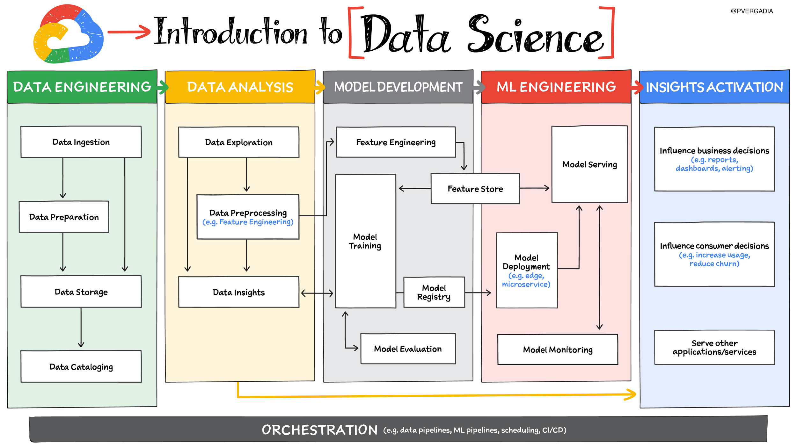](https://thecloudgirl.dev/NEXT2020.html) | [:link:](https://cloud.google.com/blog/topics/google-cloud-next/complete-list-of-announcements-from-google-cloud-next20-onair)

# Pick your AI /ML Path
 | [:link:](https://cloud.google.com/blog/topics/google-cloud-next/complete-list-of-announcements-from-google-cloud-next20-onair)

# what is vertex AI
[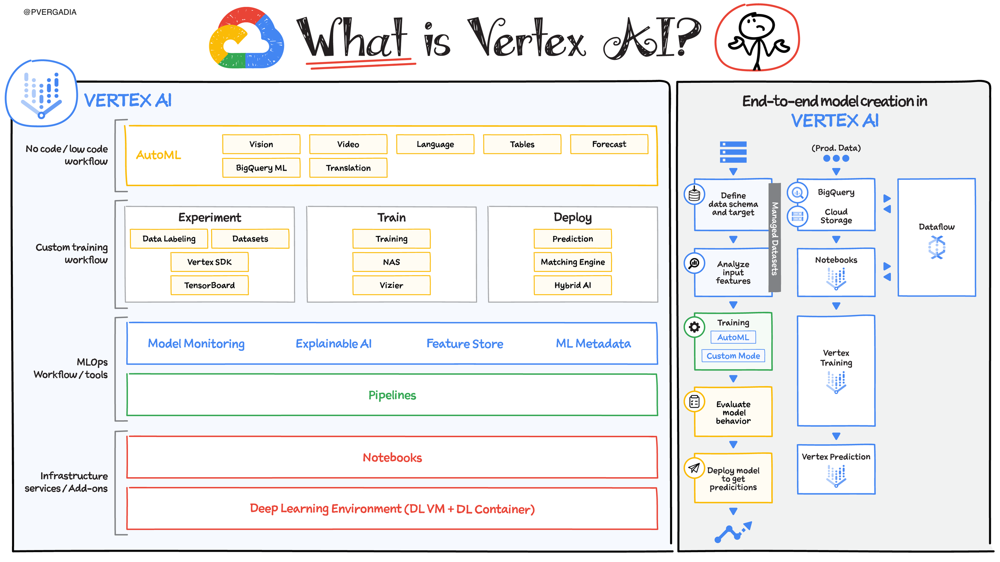](https://thecloudgirl.dev/NEXT2020.html) | [:link:](https://cloud.google.com/blog/topics/google-cloud-next/complete-list-of-announcements-from-google-cloud-next20-onair)

# NoCode Auto ML Models
[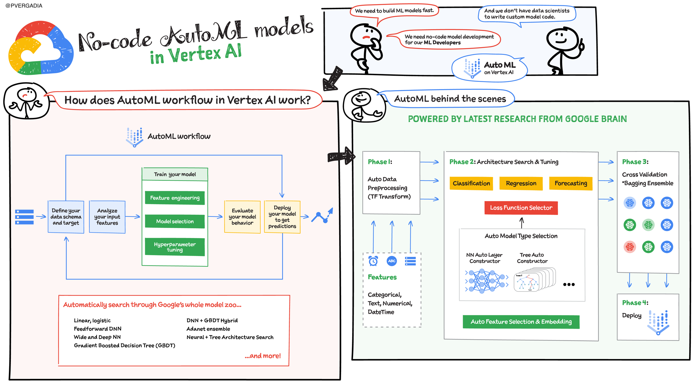](https://thecloudgirl.dev/NEXT2020.html) | [:link:](https://cloud.google.com/blog/topics/google-cloud-next/complete-list-of-announcements-from-google-cloud-next20-onair)

# MLOps
[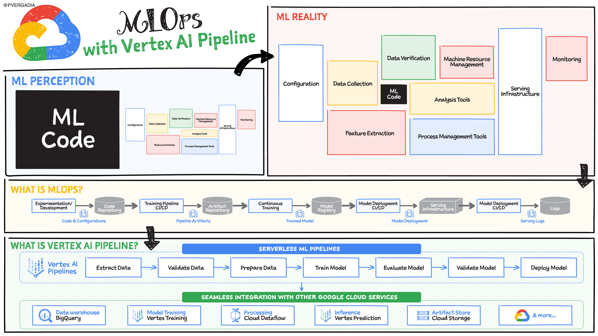](https://thecloudgirl.dev/NEXT2020.html) | [:link:](https://cloud.google.com/blog/topics/google-cloud-next/complete-list-of-announcements-from-google-cloud-next20-onair)

# Vertex Forecasting
 | [:link:](https://cloud.google.com/blog/topics/google-cloud-next/complete-list-of-announcements-from-google-cloud-next20-onair)

# BiQueryML
[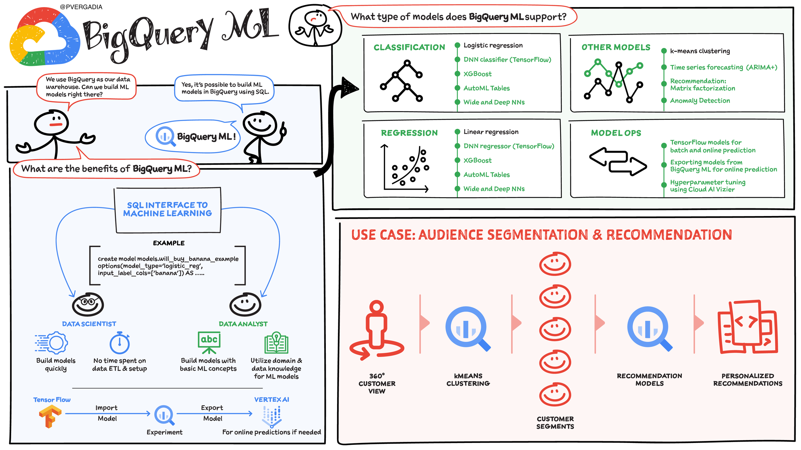](https://thecloudgirl.dev/NEXT2020.html) | [:link:](https://cloud.google.com/blog/topics/google-cloud-next/complete-list-of-announcements-from-google-cloud-next20-onair)

# Vision API
[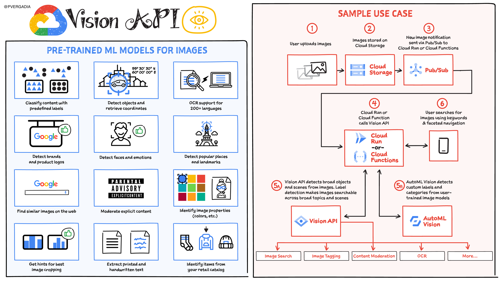](https://thecloudgirl.dev/NEXT2020.html) | [:link:](https://cloud.google.com/blog/topics/google-cloud-next/complete-list-of-announcements-from-google-cloud-next20-onair)

# Vedio AI
[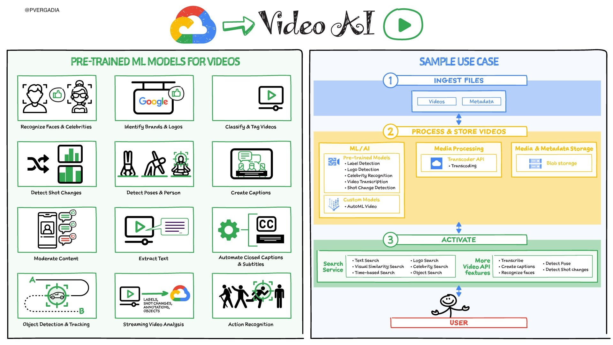](https://thecloudgirl.dev/NEXT2020.html) | [:link:](https://cloud.google.com/blog/topics/google-cloud-next/complete-list-of-announcements-from-google-cloud-next20-onair)

# Translation AI
[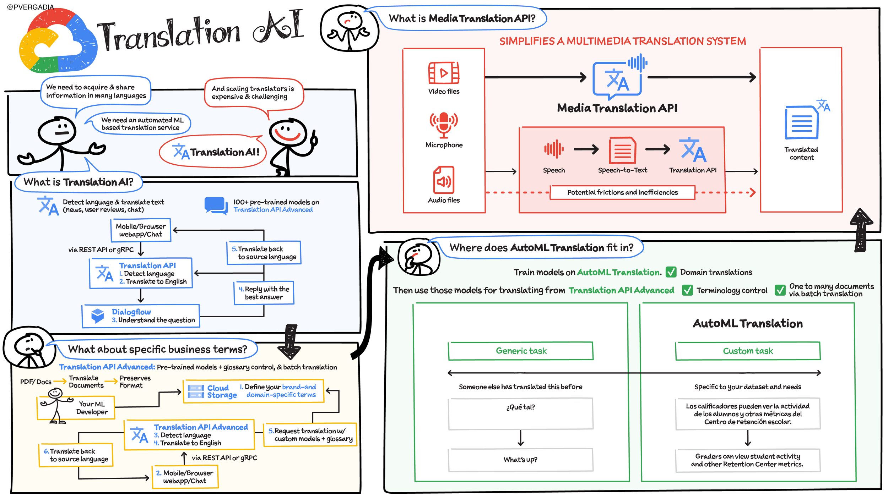](https://thecloudgirl.dev/NEXT2020.html) | [:link:](https://cloud.google.com/blog/topics/google-cloud-next/complete-list-of-announcements-from-google-cloud-next20-onair)

# Natural Language AI
[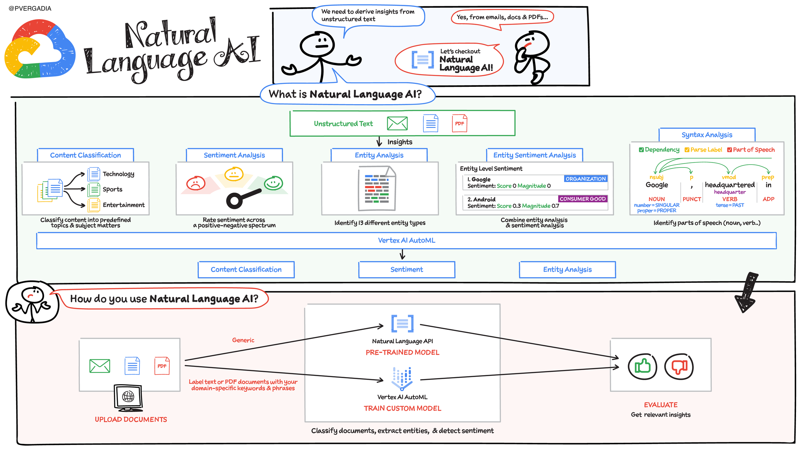](https://thecloudgirl.dev/NEXT2020.html) | [:link:](https://cloud.google.com/blog/topics/google-cloud-next/complete-list-of-announcements-from-google-cloud-next20-onair)

# Speech to Text API
[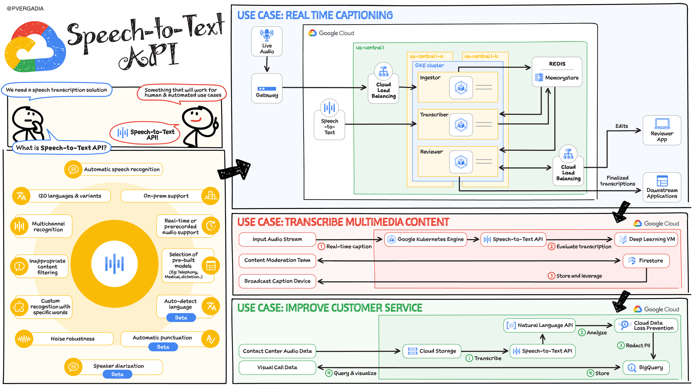](https://thecloudgirl.dev/NEXT2020.html) | [:link:](https://cloud.google.com/blog/topics/google-cloud-next/complete-list-of-announcements-from-google-cloud-next20-onair)

# Document AI
 | [:link:](https://cloud.google.com/blog/topics/google-cloud-next/complete-list-of-announcements-from-google-cloud-next20-onair)

# Contact Center AI
 | [:link:](https://cloud.google.com/blog/topics/google-cloud-next/complete-list-of-announcements-from-google-cloud-next20-onair)

# REcommendations AI
[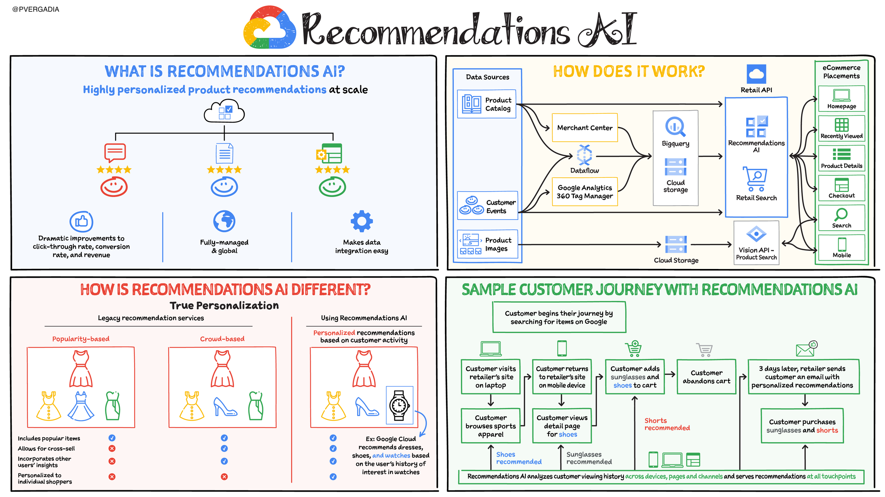](https://thecloudgirl.dev/NEXT2020.html) | [:link:](https://cloud.google.com/blog/topics/google-cloud-next/complete-list-of-announcements-from-google-cloud-next20-onair)

# DataScience in GCP
[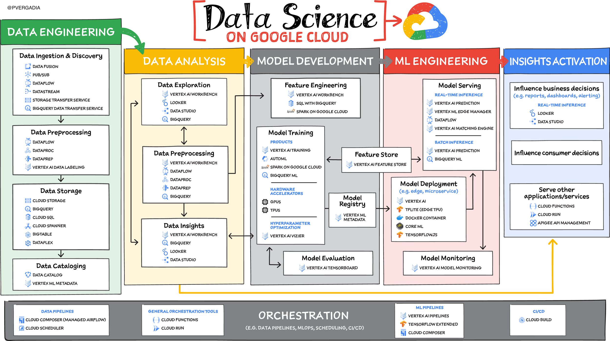](https://thecloudgirl.dev/NEXT2020.html) | [:link:](https://cloud.google.com/blog/topics/google-cloud-next/complete-list-of-announcements-from-google-cloud-next20-onair)

